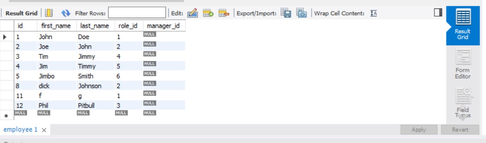

# Unit-12-MySQL-Homework-Employee-Tracker

## Description
Design the following database schema containing three tables:

* **department**:

  * **id** - INT PRIMARY KEY
  * **name** - VARCHAR(30) to hold department name

* **role**:

  * **id** - INT PRIMARY KEY
  * **title** -  VARCHAR(30) to hold role title
  * **salary** -  DECIMAL to hold role salary
  * **department_id** -  INT to hold reference to department role belongs to

* **employee**:

  * **id** - INT PRIMARY KEY
  * **first_name** - VARCHAR(30) to hold employee first name
  * **last_name** - VARCHAR(30) to hold employee last name
  * **role_id** - INT to hold reference to role employee has
  * **manager_id** - INT to hold reference to another employee that manager of the current employee. This field may be null if the employee has no manager
  
Build a command-line application that at a minimum allows the user to:

  * Add departments, roles, employees

  * View departments, roles, employees

  * Update employee roles

## VISUALS 

## INSTALLATION 
Node.js, MySql, and Visual Studios 
## USAGE 
With the use of node.js, Mysql visual studio, this application can be used as a employee tracker.
## SUPPORT 
we all need help once in awhile

## AUTHORS 
Isaac Mckittrick
## LICENSE 
None
## PROJECT STATUS 
Currently in final stage with possible updates in the future 